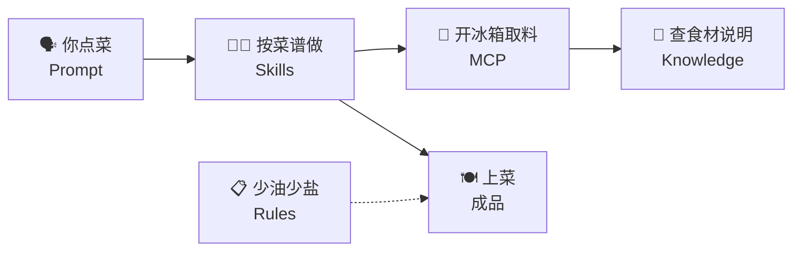
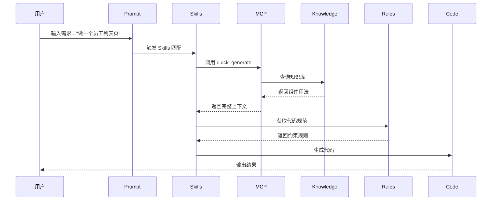

# Prompt、MCP、Skills、Rules... 终于有人把这些 AI 概念讲清楚了！

还在混淆这些概念？一篇文章彻底搞懂 AI 辅助编程的六大核心模块。

很多人用 AI 写代码时都有这样的困惑：Prompt 我知道，但 MCP 是啥？Skills 和 Rules 有什么区别？

别慌，今天用最通俗的方式，把这六个概念彻底讲清楚！

---

## 一、一顿饭秒懂六大概念

把 AI 想象成你家的**智能炒菜机器人**，你要教它做一桌好菜：



> **一句话理解**：你点菜（Prompt）→ 按菜谱做（Skills）→ 开冰箱取料（MCP）→ 查食材说明（Knowledge）→ 遵守厨房规矩（Rules）→ 上菜（成品）

**五大核心概念速查表**

| 概念 | 做饭场景 | 写代码场景 | 一句话解释 |
|------|----------|------------|------------|
| Prompt | 今晚吃红烧肉 | 帮我做个列表页 | 你说的那句话 |
| Skills | 焯水→煸炒→焖煮 | hooks→组件→检查 | 执行指南 |
| MCP | 冰箱/调料柜 | 数据库/代码库 | 连接外部资源 |
| Knowledge | 五花肉切2cm | ProTable API | 参考资料 |
| Rules | 少油少盐 | 先hooks后组件 | 必须遵守的规范 |

> **补充概念：Workflow（工作流）**= 固定流水线，如"洗→切→炒→装盘"，适合规则明确的重复任务，常见于 Coze、Dify 等平台。

**做饭 vs 写代码对照**

| 做饭 | 写代码 |
|------|--------|
| 你说"今晚吃红烧肉" | 你说"帮我做个员工列表页" |
| 遵守"少油少盐"规矩 | 遵守"先写 hooks、禁止 mock"规范 |
| 查食材说明书：五花肉怎么切 | 查知识库：ProTable 的 columns 怎么配置 |
| 从冰箱拿肉、从柜子拿调料 | 通过 MCP 连接代码库、读取类型定义 |
| 跟着私教厨师一步步做 | 按"标准列表页 Skills"流程生成代码 |

---

## 二、六个概念详解

### 1. Prompt（用户提示词）

**定义**：你输入给 AI 的那句话，是一切的起点。

**写好 Prompt 的技巧**：

| 类型 | 示例 |
|------|------|
| ❌ 模糊 | "做一个列表页" |
| ✅ 清晰 | "基于 @types/employee.ts，使用 ProTable 组件，做一个员工管理列表页，支持增删改查" |

**Prompt 优化要点**：
- 明确任务类型（列表页/表单页/详情页）
- 指定使用的组件库
- 附带相关文件上下文（@file）
- 描述具体功能需求

---

### 2. Rules（规则）

**定义**：约束 AI 行为的规范文件，告诉 AI "什么该做、什么不该做"。

**特点**：自动加载、全局生效、像公司规章制度一样必须遵守。

> **Rule vs Rules**：Rule 指单条规则，Rules 指规则集合。实际使用中统一叫 Rules，因为通常是多条规则组成一个文件。

**示例**：

```
# ai-fe-code-std.md
1. hooks 优先原则：必须先生成 hooks 文件，再生成组件
2. 禁止 mock 数据：不要生成任何假数据
3. 全局类型不要 import：检查 global.d.ts
```

**存储位置（不同工具）**：

| AI 工具 | 存储位置 |
|---------|----------|
| Cursor | `.cursor/rules/` 或项目根目录 `.cursorrules` |
| Claude Code | `CLAUDE.md` 或 `.claude/` 目录 |
| Trae | `.trae/rules/` 或项目根目录 |
| Windsurf | `.windsurfrules` |
| 通用 | 项目根目录 `ai-rules.md` |

---

### 3. Knowledge（知识库）

**定义**：领域知识和最佳实践的集合，告诉 AI "如何更好地做"。

**特点**：按需查询、提供组件用法、API 说明、代码示例。

**知识库来源**：

| 来源类型 | 说明 | 示例 |
|----------|------|------|
| 本地文件 | 项目内的知识文档 | `knowledge/ant-design-pro.md` |
| 公司 AI 后台 | 企业统一知识管理平台 | 通义灵码知识库、GitHub Copilot 知识库 |
| MCP 服务 | 通过 MCP 协议动态获取 | codegen-engine 的 `get_knowledge` 工具 |
| RAG 系统 | 向量数据库检索 | Dify、FastGPT 等平台 |

**本地知识库目录结构**：

```
knowledge/
├── common/                    # 通用组件库知识
│   ├── ant-design-pro.md     # Ant Design Pro 用法
│   ├── element-plus.md       # Element Plus 用法
│   └── vant-components.md    # Vant 移动端组件
└── business/                  # 业务组件知识
    └── company-ui.md         # 公司内部组件库
```

---

### 4. MCP（Model Context Protocol）

**定义**：让 AI 连接外部工具和数据源的统一协议。

**通俗理解**：MCP 就像万能插座标准——AI 是电器，外部系统是电源，MCP 让它们能安全连接。

**核心特点**：
- 它本身不做事，只负责"连接"
- 定义可调用的工具列表
- 管理 AI 对外部系统的访问权限

**常用 MCP 示例**：

| MCP 名称 | 功能 | 适用场景 |
|----------|------|----------|
| filesystem | 读写本地文件 | 代码生成、文件操作 |
| github | 操作 GitHub 仓库 | PR 管理、Issue 处理 |
| postgres/mysql | 数据库操作 | 数据查询、表结构分析 |
| browser | 浏览器自动化 | 前端测试、网页抓取 |
| codegen-engine | 代码生成引擎 | 页面生成、模板匹配 |
| sentry | 错误监控 | Bug 分析、日志查询 |
| slack/飞书 | 消息通知 | 团队协作、通知推送 |

**MCP 配置示例**（以 Cursor 为例）：

```json
{
  "mcpServers": {
    "codegen-engine": {
      "command": "node",
      "args": ["/path/to/codegen-engine/src/server.js"]
    },
    "filesystem": {
      "command": "npx",
      "args": ["-y", "@anthropic/mcp-filesystem"]
    }
  }
}
```

---

### 5. Skills（技能）

**定义**：给 AI 准备的专业培训手册，包含指令、脚本和资源。

> **Skill vs Skills 的关系**：
> - **Skill**（单数）= 一个具体的技能，如"代码生成 Skill"、"浏览器测试 Skill"
> - **Skills**（复数）= 技能系统/技能集合，指这整个概念或多个技能
> - 类比：**Rule** 是一条规则，**Rules** 是规则集；**Skill** 是一个技能，**Skills** 是技能库
> - 示例：`.cursor/skills/` 目录下有多个 Skill，如 `codegen-engine`、`browser-automation`

**通俗理解**：
- 以前：每次让 AI 做报销审核，都要重复一遍公司规定……
- 现在：打包成一个"报销审核" Skill，以后 AI 自己就知道该怎么做！

**四大优势**：

| 优势 | 说明 |
|------|------|
| 按需加载 | 只加载需要的，不浪费资源 |
| 可组合 | 多个 Skills 可以叠加使用 |
| 可移植 | 一次构建，到处使用 |
| 强大 | 可包含可执行代码 |

**单个 Skill 的完整结构**：

```
.cursor/skills/codegen-engine/
├── SKILL.md              # 主文件：技能说明书（必须）
├── README.md             # 快速入门指南
├── examples.md           # 使用示例
├── tools-reference.md    # 工具参考文档
└── scripts/              # 可执行脚本（可选）
    └── generate.js
```

**SKILL.md 核心模块详解**：

```markdown
# 技能名称

## Description（描述）- 必须
告诉 AI 这个技能是干嘛的、什么时候触发。
示例："当用户需要生成页面代码、创建组件、做列表页/表单页/详情页时使用此技能"

## Trigger Keywords（触发关键词）- 推荐
定义哪些词会触发这个技能。
示例：做一个列表页、生成代码、创建组件、CRUD页面

## Prerequisites（前置条件）- 可选
执行前需要满足的条件。
示例：项目中需要有 types 目录、需要配置 MCP 服务

## Workflow（工作流程）- 必须
一步步告诉 AI 怎么做。
示例：
1. 调用 quick_generate 获取上下文
2. 根据技术栈选择模板
3. 先生成 hooks 文件
4. 再生成组件文件
5. 调用 check_code_compliance 检查规范

## Tools（使用的工具）- 推荐
列出会用到的 MCP 工具。
示例：quick_generate、detect_tech_stack、check_code_compliance

## Examples（示例）- 推荐
具体的使用案例，AI 学得最快。

## Notes（注意事项）- 可选
特殊情况的处理方式。
```

**存储位置（不同工具）**：

| AI 工具 | Skills 存储位置 |
|---------|-----------------|
| Cursor | `.cursor/skills/技能名称/SKILL.md` |
| Claude Code | `~/.claude/skills/` 或项目内 `.claude/skills/` |
| Trae | `.trae/skills/` |
| 全局共享 | `~/.cursor/skills/`（用户级别，所有项目可用） |

**渐进式加载机制**：

| 级别 | 加载时机 | 内容 | Token 消耗 |
|------|----------|------|------------|
| L1 | AI 启动时 | 名称+描述 | 约 100 Token |
| L2 | 技能触发时 | SKILL.md 完整内容 | < 5000 Token |
| L3 | 按需加载 | scripts/、references/ | 不限 |

---

### 6. Workflow（工作流）

**定义**：把复杂任务拆成固定步骤，按顺序执行。

**特点**：步骤固定、流程确定、适合重复性任务。

**与 Skills 的区别**：

| 维度 | Workflow | Skills |
|------|----------|--------|
| 灵活性 | 固定流程，不会变通 | 智能判断，可以调整 |
| 设计方式 | 拖拽式可视化编排 | 文档+脚本+资源 |
| 适用平台 | Coze、Dify、n8n、Zapier | Cursor、Claude Code、Trae |
| 适用场景 | 规则明确的重复任务 | 需要专业判断的复杂任务 |

---

## 三、最容易混淆：Skills vs MCP vs Knowledge

**一句话区分**：
- **MCP** = 工具清单（有什么工具）
- **Skills** = 施工流程（怎么干活）
- **Knowledge** = 参考手册（具体参数）

| 对比项 | MCP | Skills | Knowledge |
|--------|-----|--------|-----------|
| 本质 | 工具清单 | 执行流程 | 参考资料 |
| 回答问题 | "有哪些工具？" | "怎么一步步做？" | "这个参数怎么填？" |
| 做饭类比 | 厨房有什么（冰箱、灶台、刀具） | 做菜步骤（焯水→煸炒→焖煮） | 食材说明（五花肉切2cm） |
| 写代码举例 | AI 知道有 `quick_generate()` | AI 按"先 hooks 再组件"流程执行 | AI 查 ProTable 的 columns 配置 |

**最佳组合**：Skills 调度流程 + MCP 连接工具 + Knowledge 提供细节

---

## 四、实战案例：做一个员工列表页

假设你要让 AI 帮你做一个员工管理列表页，看看各个概念是如何协作的：

### 完整调用流程图



### 各环节实际内容

**1. 用户输入（Prompt）**

```
基于 @src/types/employee.ts 类型定义，做一个员工管理列表页，需要支持增删改查，使用 ProTable 组件
```

**2. Skills 匹配**

AI 识别到关键词"列表页"、"增删改查"，自动匹配 `codegen-engine` Skill，读取 SKILL.md 获取执行步骤。

**3. MCP 工具调用**

调用 `quick_generate` 工具，返回：

```json
{
  "techStack": "React + TypeScript + Ant Design Pro",
  "template": "react-standard-list-crud",
  "knowledge": "ProTable 用法、columns 配置、request 写法"
}
```

**4. Knowledge 查询**

从知识库获取 ProTable 最佳实践：

```
- 使用 request 而不是 dataSource
- 配置 rowKey 避免警告
- 使用 actionRef 控制刷新
```

**5. Rules 约束**

代码生成时遵循规范：

```
- 必须先生成 hooks/useEmployeeTable.ts
- 再生成 index.tsx 组件
- 禁止 mock 数据
- 全局类型不要 import
```

**6. 最终输出**

```
✅ hooks/useEmployeeTable.ts  （数据逻辑）
✅ components/EditModal.tsx   （编辑弹窗）
✅ index.tsx                  （主页面）
✅ types.ts                   （类型定义）
```

---

## 五、打造优质 Skills 的五大心法

1. **单一职责**：一个 Skill 只做一件事
2. **示例驱动**：多放具体使用示例，AI 学得最快
3. **清晰输入输出**：像设计 API 一样设计接口
4. **原子化设计**：像乐高积木，可灵活组合
5. **持续迭代**：记录问题，定期更新

---

## 六、常见问题

**Q1: Prompt 和 Rules 有什么区别？**

- Prompt：临时输入，一次性
- Rules：配置文件，持久化

**Q2: 什么时候用 Skills，什么时候直接写 Prompt？**

- 用 Skills：重复性任务、标准流程、多工具协作
- 直接 Prompt：一次性任务、简单修改

**Q3: Skills 不生效怎么办？**

核心原因是描述（Description）不够清晰。用大白话明确触发场景。

**Q4: Skills 本质上不就是 Prompt 吗？**

对也不对。一个 Skill = Prompt + 脚本 + 上下文管理 + 智能触发。

就像说"汽车本质是发动机"——没错，但光有发动机跑不起来。

> Prompt 是"配方"，Skill 是"配方+厨具+食材"打包的预制菜套餐。多个 Skill 组成 Skills 技能库。

---

## 七、学习路径

| 场景 | 推荐方案 |
|------|----------|
| 偶尔让 AI 帮忙 | Prompt 就够了 |
| AI 长期扮演某角色 | 用 Rules |
| 经常做复杂的事 | 用 Skills |
| 访问私有数据/API | 配置 MCP |
| 重复执行固定流程 | 用 Workflow 平台 |

学习建议：Prompt → Workflow → Skills → MCP，循序渐进。

---

## 八、结语

Skills 解决了一个根本问题：如何让 AI 不仅懂理论，还能上手实操。

对开发者来说，最大的好处是：可控、可复用、可迭代。

> 最好的 Skill，往往是那些解决你日常工作痛点的。别追求大而全，小而美往往更实用。

---

## 相关文档

- [MCP-TOOLS.md](./MCP-TOOLS.md) - MCP 工具完整文档
- [rules/ai-fe-code-std.md](./rules/ai-fe-code-std.md) - 代码生成规范
- [🤖AI驱动的B端页面开发指南](./🤖AI驱动的B端页面开发指南（MCP版）.md) - 完整开发指南
