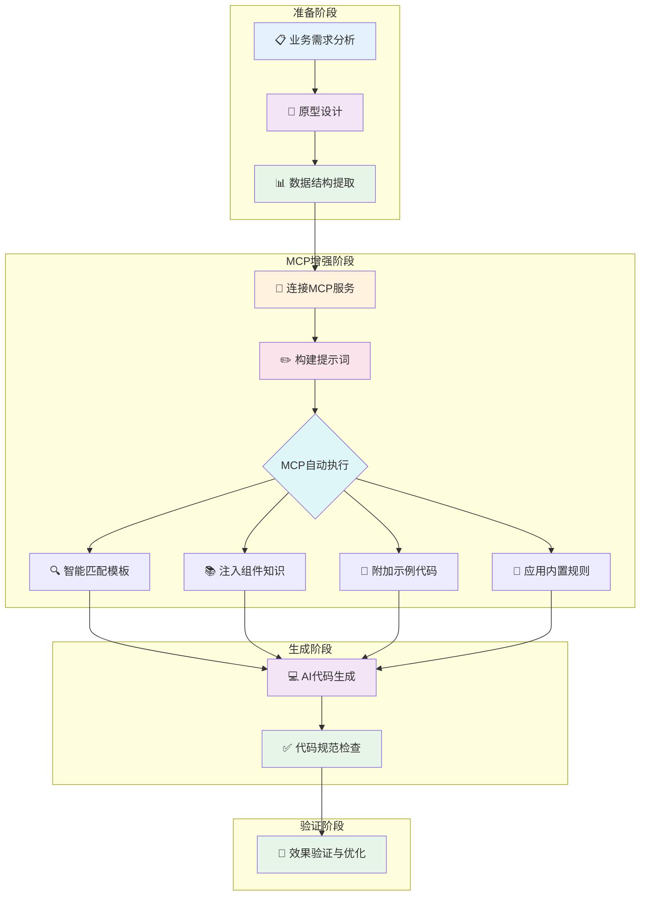

# 🤖 AI 驱动的前端页面开发指南（MCP 版）

> 适用于 PC 端 + H5 移动端页面开发，统一使用方式，MCP 自动匹配最佳模板

---

## 📋 概述

基于 **AI 代码生成引擎（MCP 版）** 快速生成企业级 B 端页面的完整流程指南，涵盖表格页面、表单页面、详情页面、H5 页面等常见场景，适用于前后端开发人员。

通过 MCP（Model Context Protocol）协议，AI 可以智能匹配模板、注入组件库知识、自动附加示例代码，**显著提升代码生成质量和可用度**。

### ✨ MCP 版核心优势

| 特性 | 本地添加 Rule | MCP 版 |
|------|------------|--------|
| 规则文件 | 需手动添加到项目 | ✅ **内置自动生效，无需配置** |
| 模板匹配 | 无 | ✅ 智能匹配 13+ 种模板 |
| 组件库知识 | 无 | ✅ 自动注入组件使用方法 |
| 示例代码 | 无 | ✅ 自动附加最佳实践代码 |
| 技术栈检测 | 无 | ✅ 自动识别 React/Vue2/Vue3 |
| 全局类型检查 | 无 | ✅ 避免重复 import |
| 代码可用度 | 中 | **高** ✨ |

> 💡 **核心优势**：MCP 内置了 `ai-fe-code-std.md` 规则文件，连接 MCP 后规则自动生效，用户无需在本地添加任何规则文件，即可享受完整的代码生成增强能力。

---

## ✨ 原型 --> 效果

[图片]

[图片]

---

## ⚡ 开发效率提升

### 传统开发 vs AI 驱动开发

通过 AI 驱动的开发方式，能够提升 B 端页面开发效率，特别是在标准化业务场景中表现突出。

| 对比维度 | 传统开发 | AI 驱动开发 | 提升效果 |
|---------|---------|------------|---------|
| 总体开发时间 | 2人天 | 1.2人天 | 40% 左右 |
| 原型生成 | 需要手动编写 | 快速生成可运行的模板页面原型 | 提升明显 |
| 代码规范 | 依赖开发者经验 | 自动遵循企业级代码规范 | 一致性保障 |
| 代码维护 | 质量参差不齐 | 生成的代码结构清晰，便于后续维护 | 维护成本降低 |
| 需求迭代 | 手动修改代码 | 需求变更时可快速重新生成 | 迭代效率提升 |

---

## 🔄 完整开发流程图



### 流程步骤详解

> 🔄 核心开发流程：
> 📋 业务需求 ➜ 🔌 连接MCP ➜ 📊 数据结构提取 ➜ ✏️ 提示词生成 ➜ 💻 MCP增强生成 ➜ 🎯 效果验证

| 步骤 | 🎯 阶段 | 📥 输入 | 📤 输出 |
|-----|--------|--------|--------|
| 1️⃣ | 连接 MCP 服务 | AI 工具配置 | MCP 连接成功，规则自动生效 |
| 2️⃣ | 数据结构提取 | 原型图表头 | JSON 数据结构 / 接口类型文件 |
| 3️⃣ | 提示词构建 | 数据结构 + 功能需求 | 标准化提示词 |
| 4️⃣ | MCP 增强生成 | 提示词 | 模板匹配 + 组件知识 + 示例代码 + 规则 |
| 5️⃣ | AI 代码生成 | 增强后的上下文 | 完整前端代码 |
| 6️⃣ | 效果验证 | 生成代码 | 优化后的页面 |

---

## 🔌 第一步：连接 MCP 服务

### 目标

在 AI 工具中配置并连接 AI 代码生成引擎 MCP 服务

### 配置方式

#### 通义灵码 / Cursor / 其他支持 MCP 的 AI 工具

在 AI 工具的 MCP 配置中添加：

- **类型**：Streamable HTTP
- **服务地址**：`http://[服务器地址]:7331/mcp`

> 💡 **说明**：MCP 服务已部署在服务器上，无需本地启动，直接连接即可使用。

### 验证连接

连接成功后，AI 工具将自动获得以下能力：

- ✅ **规则自动生效**（无需本地添加 Rule 文件）
- ✅ 智能模板匹配（13+ 种页面模板）
- ✅ 组件库知识图谱注入（Ant Design Pro / Element Plus / Vant）
- ✅ 示例代码自动附加
- ✅ 代码规范自动检查

---

## 📋 页面开发指南

📝 **说明**：使用 MCP 后，无需区分标准页面或非标页面，MCP 会根据需求自动匹配最合适的模板和示例代码。无论是列表页、表单页、详情页还是 H5 页面，都采用统一的提示词格式。

---

### 📊 第一步：业务需求分析与数据结构提取

#### 目标

从设计稿或需求中提取标准化数据结构

#### 数据来源

- 📸 表格截图/UI 设计稿
- 📊 Excel 文件
- 📝 需求文档

#### 操作步骤

**1️⃣ 步骤1：获取原型图示例**

[图片]

**2️⃣ 步骤2：截取表格表头**

[图片]

**3️⃣ 步骤3：使用 AI 提示词模板**

```
请根据以上表格整理出英文属性，以json格式表达并生成数据库创建表语句和java实体类（使用lombok带注释）
```

**4️⃣ 步骤4：生成数据结构示例**

> 鉴于目前通义灵码图文识别效果不佳，推荐使用 deepseek/豆包/kimi 等 AI 工具。

[图片]

#### 输出示例

**JSON 数据结构**

```json
{
  "lastName": "姓氏",
  "firstName": "名字", 
  "suffix": "后缀",
  "raCode": "RA代码",
  "trafficWhitelist": "交通白名单",
  "accommodationWhitelist": "住宿白名单",
  "approvalWhitelist": "审批白名单",
  "type": "类型"
}
```

---

### ✏️ 第二步：构建 AI 提示词（MCP 版）

#### 目标

基于数据结构生成标准化的 AI 提示词，通过 MCP 自动匹配模板和注入上下文

#### 模板结构

> 📝 构成要素：**MCP调用声明 + 文件夹名称 + 接口/数据结构 + 功能需求**
> 
> 💡 MCP 会自动匹配最合适的模板，也可以手动指定模板 ID

#### 接口及数据结构（二选一）

提示词中的数据结构支持两种方式，根据实际情况选择：

**方式一：使用实际接口文件（推荐）**

如果项目中已有接口类型定义和接口调用函数，优先使用此方式，可显著提高生成代码的准确度：

```
接口及数据结构：
接口类型：travelApply.d.ts
接口：applyDetailApi
以文件为主
```

**方式二：使用 Mock 数据结构**

如果接口尚未开发完成，可使用 JSON 格式的 mock 数据结构：

```
接口数据结构：{
  "lastName": "姓氏",
  "firstName": "名字", 
  "suffix": "后缀",
  "raCode": "RA代码",
  "trafficWhitelist": "交通白名单",
  "accommodationWhitelist": "住宿白名单",
  "approvalWhitelist": "审批白名单",
  "type": "类型"
}
```

#### 标准提示词模板

```
调用mcp工具codegen-engine执行下列任务：
任务标准：ai-fe-code-std.md为标准执行任务

文件夹名称: lists

接口及数据结构：
接口类型：whitelist.d.ts
接口：getWhitelistApi
以文件为主

（或使用 mock 数据结构）
接口数据结构：{
  "lastName": "姓氏",
  "firstName": "名字", 
  "trafficWhitelist": "交通白名单",
  "type": "类型"
}

页面需求：
核心功能
- 搜索：多条件查询员工信息
- 变更：修改白名单状态
- 批量按钮：推送到滴滴系统、推送商旅系统

页面组成
- 主页面：搜索表单 + 数据表格 + 批量操作
- 编辑弹窗：白名单开关 + 变更原因 + 文件上传

关键字段
- 搜索：姓名、工号、职级、三个白名单、有效性
- 列表：基本信息 + 三个白名单 + 操作记录
- 编辑：三个白名单 + 变更原因 + 审批邮件

业务规则
- 白名单默认"否"
- 附件限制5MB
- 交通白名单变更需确认
```

#### 提示词组成说明

| 组成部分 | 说明 | 示例 |
|---------|------|------|
| MCP调用声明 | 声明调用MCP工具和任务标准 | `调用mcp工具codegen-engine执行下列任务` |
| 文件夹名称 | 页面目录名称（kebab-case） | `lists` / `detail` / `edit` |
| 接口及数据结构 | 实际接口文件 或 mock JSON 数据 | 见上方两种方式 |
| 功能需求 | 详细的功能描述 | 核心功能 + 页面组成 + 业务规则 |

#### 可用模板列表

**React 模板（PC 端）**

| 模板 ID | 模板名称 | 适用场景 |
|---------|---------|---------|
| `react-standard-list-crud` | React 标准列表页 | 列表、表格、搜索、CRUD |
| `react-standard-modal-form` | React 标准弹窗表单 | 弹窗新增/编辑表单 |
| `react-standard-form-page` | React 标准表单页 | 独立路由的新增/编辑页面 |
| `react-drawer-form` | React 抽屉编辑表单 | 侧边抽屉表单 |
| `react-drawer-detail` | React 抽屉详情 | 侧边抽屉查看详情 |
| `react-nonstandard-detail` | React 非标详情页 | 复杂单据详情、审批流程 |
| `react-import-list-modal` | React 导入弹窗 | Excel 导入、处理结果展示 |
| `react-pc-file-upload` | React PC 文件上传 | 文件/图片上传组件 |
| `react-batch-schema-form` | React 批量表单 | 批量编辑、批量审批 |

**Vue 模板（PC 端）**

| 模板 ID | 模板名称 | 适用场景 |
|---------|---------|---------|
| `vue3-standard-list-crud` | Vue 3 标准列表页 | Element Plus 列表页 |
| `vue2-standard-list-crud` | Vue 2 标准列表页 | Element UI 列表页 |
| `vue2-pc-file-upload` | Vue 2 PC 文件上传 | Element Upload 组件 |

**H5 移动端模板**

| 模板 ID | 模板名称 | 适用场景 |
|---------|---------|---------|
| `vue2-h5-file-upload` | Vue 2 H5 文件上传 | Vant Uploader + 水印 |

#### 功能需求示例

以差旅通需求为例：

[图片]

**根据需求浓缩总结的提示词**（利用 AI 工具根据需求文档总结需求生成提示词）：

```
核心功能
- 搜索：多条件查询员工信息
- 变更：修改白名单状态
- 批量按钮：推送到滴滴系统、推送商旅系统

页面组成
- 主页面：搜索表单 + 数据表格 + 批量操作
- 编辑弹窗：白名单开关 + 变更原因 + 文件上传

关键字段
- 搜索：姓名、工号、职级、三个白名单、有效性
- 列表：基本信息 + 三个白名单 + 操作记录
- 编辑：三个白名单 + 变更原因 + 审批邮件

业务规则
- 白名单默认"否"
- 附件限制5MB
- 交通白名单变更需确认
```

#### 字段映射（可选）

- id: 主键，序号显示

| 字段特征 | 推荐组件 | 搜索方式 |
|---------|---------|---------|
| name、title | ProFormText | 模糊搜索 |
| time、date | ProFormDatePicker | 范围搜索 |
| status、type | ProFormSelect | 下拉选择 |
| amount、price | ProFormDigit | 范围搜索 |
| id、no | ProFormText | 精确搜索 |

---

### 💻 第三步：AI 代码生成（MCP 自动执行）

#### 目标

使用 AI 工具 + MCP 生成完整的前端代码

#### 生成步骤

**1️⃣ 输入完整提示词**
- 📋 复制标准提示词模板
- ✏️ 填入具体的数据结构和功能需求

**2️⃣ MCP 自动执行**
- 🔍 智能匹配最合适的模板
- 📚 自动注入组件库知识图谱（Ant Design Pro / Element Plus）
- 📄 自动附加示例代码

**3️⃣ 确认生成**
- 📁 目录结构配置
- 📄 文件数量确认
- ✅ 代码规范自动遵循

**4️⃣ 执行生成**
- 🚀 启动 AI 代码生成
- ⏳ 等待生成完成

[图片]

#### 页面类型

- 📊 表格页面：数据列表展示、搜索筛选、CRUD 操作
- 📝 表单页面：数据录入、编辑、验证
- 📄 详情页面：数据详情展示、相关操作
- 📱 H5 页面：移动端表单、列表、上传等

#### 适用场景

- 🏢 管理后台系统
- 📊 数据分析平台
- 🛠️ 运营管理工具
- 📋 业务流程系统
- 📱 H5 移动端应用

#### 目标前端项目结构

```
src/
├── pages/[模块名]/
│   ├── hooks.ts              # 🎣 业务逻辑钩子
│   ├── components/
│   │   ├── ModalForm.tsx     # 📝 模态框表单
│   │   └── DrawerForm.tsx    # 📋 抽屉表单
│   ├── types.ts              # 🏷️ 类型定义
│   ├── index.less            # 🎨 样式文件
│   └── index.tsx             # 📄 主页面组件
```

---

### 🔧 第四步：代码优化与效果验证

#### 目标

根据项目需求，针对性优化前端代码

#### 优化内容

**📏 代码质量优化**
- 🏷️ TypeScript 类型完善
- 📏 ESLint 规则检查
- ⚡ 组件性能优化

**🚀 功能完善**
- 🎯 业务逻辑补充
- 🎨 交互体验优化
- 📱 响应式适配

**🎨 样式调整**
- 🎯 UI 设计规范对齐
- 🎨 主题色彩配置
- 📐 布局细节优化

#### 最终效果展示

[图片]

---

### ✅ 检查清单

#### 文件完整性

- [ ] 🎣 hooks.ts - 业务逻辑钩子
- [ ] 📝 components/ModalForm.tsx - 模态框表单
- [ ] 📋 components/DrawerForm.tsx - 抽屉表单
- [ ] 🏷️ types.ts - 类型定义
- [ ] 🎨 index.less - 样式文件
- [ ] 📄 index.tsx - 主页面组件

#### 代码质量

- [ ] ✅ TypeScript 编译无错误
- [ ] 📏 ESLint 检查通过
- [ ] 🔗 组件导入路径正确
- [ ] 🏷️ 类型定义完整准确
- [ ] 🎨 样式文件正常加载

#### ⚠️ 注意事项

- 💾 **数据结构保存**：保存第一步的 JSON 数据结构，后续步骤需要使用
- 🔗 **依赖版本**：确保项目依赖版本匹配
- 🎯 **需求调整**：根据实际业务需求调整功能描述
- ✅ **质量验证**：生成后及时验证代码质量和功能完整性

---

### 📋 详情页提示词示例

以下是详情页的完整提示词示例，使用方式与列表页完全一致，MCP 会自动匹配合适的模板。

#### ✨ 原型 --> 效果

[图片]

[图片]

#### 完整示例：出差申请单详情页

```
调用mcp工具codegen-engine执行下列任务：
任务标准：ai-fe-code-std.md为标准执行任务

文件夹名称: detail

接口及数据结构：
接口类型：travelApply.d.ts
接口：applyDetailApi
以文件为主

页面需求：
点击index列表页查看出差申请单号，跳转进入出差申请单详情页

标题：出差申请单
单据号：出差申请单号

基本信息
- 申请人：申请人姓名
- 工号：申请人工号
- 成本中心：申请人所在成本中心
- 承担成本中心：出差申请单承担成本中心
- 发薪公司
- 出差类型
- 申请日期

差旅信息
- 行程时间：行程开始时间 至 行程结束时间
- 行程城市：出发城市 至 到达城市
- 出差原因
- 项目酒店：无数据不展示
- 补充说明：无数据不展示

附件
- 无数据不展示
- 展示缩略图，点击预览图片

流程信息
每个模块的标题在左边且底色灰黑色。
流程信息显示审批节点信息，包括审批人、审批时间、审批意见。
流程明细以列表形式展示，表头包括：审批节点、审批人、结果、意见、时间。

样式可参考 hz-trip-travel-apply-info 详情页面
```

[图片]

---

## 📊 不同出码模式效果对比

💡 **说明**：通过不同的出码模式组合，可以获得不同的代码可用度和效果。以下是四种模式的对比分析。

### 示例需求

[图片]

### ✨ 四种模式效果对比

**模式1：Agent 出码**

[图片]

**模式2：Agent + 参考页面**

[图片]

**模式3：Agent + MCP**

[图片]

**模式4：Agent + MCP + 参考页面**

[图片]

### 结论

| 模式 | 代码可用度 | 效果图 | 复杂度 |
|------|-----------|--------|--------|
| Agent 出码 | 低 | ⭐ | ⭐ |
| Agent + 参考页面 | 中 | ⭐⭐⭐ | ⭐⭐ |
| Agent + MCP | 中高 | ⭐⭐⭐⭐ | ⭐⭐ |
| **Agent + MCP + 参考页面** | **高** ✨ | ⭐⭐⭐⭐⭐ | ⭐⭐⭐ |

**关键结论**：
- 🎯 **Agent 出码**：仅使用 AI Agent，代码可用度较低，需要大量手动调整
- 📋 **Agent + 参考页面**：提供项目中现有类似页面作为参考，代码可用度明显提升
- 🔧 **Agent + MCP**：通过 MCP 注入模板和组件知识，代码可用度进一步提升
- 🚀 **Agent + MCP + 参考页面**：结合 MCP 和参考页面，代码可用度最高，效果最佳

### 💡 使用建议

**推荐组合**：Agent + MCP + 参考页面

**为什么推荐这种组合？**
1. **MCP 提供基础能力**：自动匹配模板、注入组件库知识、附加示例代码
2. **参考页面提升质量**：AI 直接学习项目的代码风格和架构模式，生成的代码与现有代码库高度一致
3. **减少修改工作**：生成的代码基本可用，避免多轮迭代调整
4. **保持风格统一**：自动继承项目的设计风格、组件使用规范和交互模式

**如何提供参考页面？**

在提示词中添加以下信息：
- 参考页面的文件路径或名称
- 参考页面的主要功能和结构
- 需要修改或调整的地方

---

## 🛠️ MCP 模板与工具详解

### 📋 概述

AI 代码生成引擎提供 **15 个** MCP 工具和 **13+ 种**页面模板，支持智能模板匹配、组件库知识注入、示例代码自动附加。

> 💡 **规则文件已内置**：`ai-fe-code-std.md` 已集成在 MCP 中，用户无需手动添加规则文件。

---

### 📦 可用模板详解

#### React 模板（PC 端）

| 模板 ID | 模板名称 | 适用场景 | 关键词 |
|---------|---------|---------|--------|
| `react-standard-list-crud` | React 标准列表页 | 列表、表格、搜索、CRUD | ProTable、新增、编辑、删除、批量 |
| `react-standard-modal-form` | React 标准弹窗表单 | 弹窗新增/编辑表单 | ModalForm、对话框、表单提交 |
| `react-standard-form-page` | React 标准表单页 | 独立路由的新增/编辑页面 | 表单页、保存、校验、路由参数 |
| `react-drawer-form` | React 抽屉编辑表单 | 侧边抽屉表单 | DrawerForm、侧边、新增、编辑 |
| `react-drawer-detail` | React 抽屉详情 | 侧边抽屉查看详情 | Drawer、查看详情、侧边详情 |
| `react-nonstandard-detail` | React 非标详情页 | 复杂单据详情、审批流程 | 详情页、单据详情、审批、流程、时间轴 |
| `react-import-list-modal` | React 导入弹窗 | Excel 导入、处理结果展示 | 导入、上传、excel、模板下载、处理结果 |
| `react-pc-file-upload` | React PC 文件上传 | 文件/图片上传组件 | 上传、文件上传、图片上传、进度条 |
| `react-batch-schema-form` | React 批量表单 | 批量编辑、批量审批 | 批量、批量编辑、schema、动态表单 |

#### Vue 模板（PC 端）

| 模板 ID | 模板名称 | 适用场景 | 关键词 |
|---------|---------|---------|--------|
| `vue3-standard-list-crud` | Vue 3 标准列表页 | Element Plus 列表页 | el-table、vue3、composition、搜索 |
| `vue2-standard-list-crud` | Vue 2 标准列表页 | Element UI 列表页 | getwayTable、vue2、options、搜索 |
| `vue2-pc-file-upload` | Vue 2 PC 文件上传 | Element Upload 组件 | 上传、element、进度条 |

#### H5 移动端模板

| 模板 ID | 模板名称 | 适用场景 | 关键词 |
|---------|---------|---------|--------|
| `vue2-h5-file-upload` | Vue 2 H5 文件上传 | Vant Uploader + 水印 | vant、h5、移动端、水印、uploader |

---

### 🔧 MCP 工具列表

#### 核心工具（必须了解）

| 工具名称 | 功能描述 | 使用场景 |
|---------|---------|---------|
| ⭐ `generate_code_context` | **一键生成完整代码上下文**（必须优先调用） | 整合技术栈检测、模板匹配、示例代码、组件知识 |
| ⭐ `check_code_compliance` | **检查代码规范符合性**（生成后必须调用） | 验证 hooks 文件、类型定义、文件结构 |
| `smart_match_template` | 智能匹配模板（含技术栈+兜底） | 根据需求自动匹配最合适的模板 |
| `build_prompt` | 构建增强版提示词 | 自动注入组件库知识和示例代码 |

#### 模板相关工具

| 工具名称 | 功能描述 | 核心参数 |
|---------|---------|---------|
| `list_templates` | 列出所有可用模板 | 无 |
| `get_template` | 获取指定模板详情 | `id` |
| `match_template` | 智能匹配最合适的模板 | `text`, `topK` |
| `get_code_examples` | 获取模板示例代码 | `templateId` |

#### 知识库相关工具

| 工具名称 | 功能描述 | 核心参数 |
|---------|---------|---------|
| `get_component_knowledge` | 获取组件库知识图谱 | `scope` (common/business) |
| `search_spec` | 搜索规范文档 | `query`, `maxResults` |
| `get_spec_content` | 获取规范文档内容 | `section` |

#### 项目检测工具

| 工具名称 | 功能描述 | 核心参数 |
|---------|---------|---------|
| `detect_tech_stack` | 检测项目技术栈 | `projectPath` |
| `find_similar_components` | 查找项目中相似组件 | `projectPath`, `keywords` |
| `check_global_types` | 检查项目全局类型声明 | `projectPath` |
| `parse_api_types` | 解析接口类型文件 | `filePath` |

---

### 🚀 推荐使用流程

#### 标准开发流程

```
1️⃣ 调用 generate_code_context 获取完整上下文
   ├── 自动检测技术栈
   ├── 智能匹配模板
   ├── 获取示例代码
   ├── 注入组件库知识
   └── 返回规则执行提醒

2️⃣ 按照返回的 ruleEnforcement 执行代码生成
   ├── 先生成 hooks/composables 文件
   ├── 再生成组件文件
   └── 遵循接口数据结构

3️⃣ 调用 check_code_compliance 检查代码规范
   ├── 验证文件完整性
   ├── 检查生成顺序
   └── 输出自检报告
```

#### 模板匹配算法

MCP 使用智能匹配算法选择最合适的模板：

| 匹配因素 | 分数调整 |
|---------|---------|
| 正向关键词匹配 | **+2 分** |
| 反向关键词匹配 | **-3 分** |
| 场景加权 | **+3 分** |
| 技术栈完全匹配 | **+10 分** |
| 技术栈部分匹配 | **+5 分** |
| 技术栈不匹配 | **-15 分** |
| UI 库匹配 | **+3 分** |

---

### 💡 核心规则提醒

MCP 内置的规则文件包含以下核心规则：

1. ⭐ **【必须】先生成 hooks/composables 文件，再生成组件文件**
2. ⭐ **【必须】接口数据结构以文件为主，不要推测字段**
3. ⭐ **【必须】检查全局类型，避免重复 import**
4. ⭐ **【禁止】生成任何 mock 数据或假数据**

---

## 📚 附录

### 代码可用度对比

| 方案 | 代码可用度 | 使用成本 | 维护成本 |
|------|-----------|---------|---------|
| 纯提示词 | 低 | 高 | 低 |
| 提示词 + Rule | 中 | 中 | 中 |
| **MCP + 示例代码** | **高** ✨ | **低** | **中** |

---

**🎉 享受智能代码生成的乐趣！**
